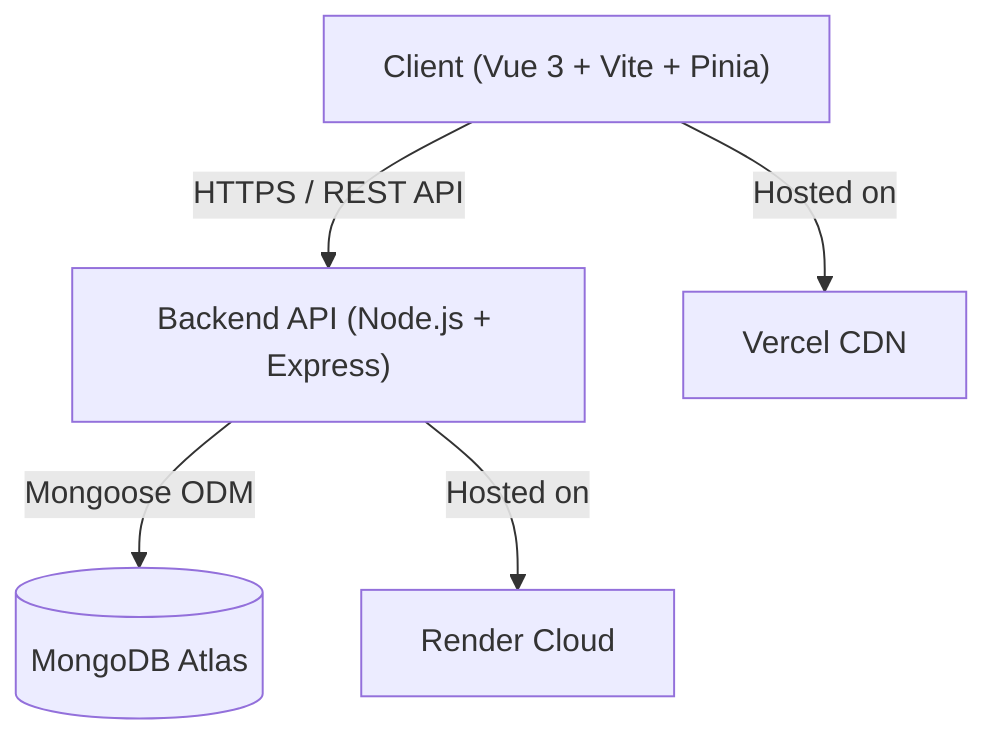

# FUPRE Post-UTME CBT Portal 🚀

[](https://vuejs.org/)
[](https://vitejs.dev/)
[](https://nodejs.org/)
[](https://expressjs.com/)
[](https://www.mongodb.com/)
[](LICENSE)

A modern, high-performance, full-stack **Computer-Based Testing (CBT) platform** engineered for prospective students preparing for the **Federal University of Petroleum Resources, Effurun (FUPRE) Post-UTME screening examination**. 

The platform accurately simulates real-world exam conditions with authentic past questions, time limits, question navigators, LaTeX mathematical rendering, instant server-side grading, progress analytics, and step-by-step solution reviews.

---

## 🌟 Key Features

### 🎯 1. Authentic Exam Simulation
- **Institutional Subject Selection**: Enforces FUPRE requirements—**English Language** and **Mathematics** are compulsory, with candidates selecting exactly 2 science electives from **Physics**, **Chemistry**, and **Biology**.
- **Multi-Year Question Bank**: Practice questions from **2023**, **2024**, **2025**, or dynamic **Random Mix** across all years.
- **Dynamic Timing**: Automatically calculates exam duration based on the question count ($1.5\text{ minutes per question}$) with autosubmit upon timer expiration.

### 📐 2. LaTeX Math & Chemical Equation Rendering
- Seamless integration of **KaTeX** for rendering complex mathematical notations, formulas, powers, fractions, and scientific symbols in questions, options, and explanations.

### 🖩 3. Integrated Scientific Floating Calculator
- On-screen popup calculator accessible during exams for numerical calculations, arithmetic, and percentages.

### 📊 4. Instant Grading & Subject Breakdown
- **Secure Server-Side Grading**: Answers are validated against MongoDB without exposing answer keys to the client.
- **Granular Subject Analytics**: View individual scores, accuracy percentages, and letter grades ($A, B, C, F$) for each subject.
- **Visual Score Wheel & Animated Confetti**: Celebratory feedback for high achievers ($\ge 70\%$).

### 📝 5. Comprehensive Answer Review & Explanations
- Filter questions by status (**All**, **Correct**, **Wrong**) or by **Subject**.
- Highlights correct answers in green, incorrect choices in red, and provides detailed pedagogical explanations.

### 📈 6. Candidate Dashboard & Motivational StudyBot
- Visual bar charts depicting historical performance across past exam sessions.
- AI-inspired **StudyBot** offering contextual performance feedback and encouragement based on the candidate's average score.

### 🌓 7. Dark & Light Mode Support
- Fully themeable UI with smooth CSS transitions and persisted theme preference.

### 🔒 8. Enterprise-Grade Security & Resilience
- **JWT Authentication** with password hashing using **BcryptJS**.
- Centralized error-handling middleware, request validation, and safe token interceptors.
- Automatic database seeding fallback on boot for fresh deployments.

---

## 🏗️ Architecture & Technology Stack



### **Frontend**
- **Framework**: [Vue 3](https://vuejs.org/) (Composition API with `<script setup>`)
- **Build Tool**: [Vite](https://vitejs.dev/)
- **State Management**: [Pinia](https://pinia.vuejs.org/)
- **Routing**: [Vue Router 4](https://router.vuejs.org/) with authentication guards
- **HTTP Client**: [Axios](https://axios-http.com/) with request/response interceptors
- **Math Engine**: [KaTeX](https://katex.org/)
- **Styling**: Vanilla CSS Design System with responsive grid layouts and CSS custom properties

### **Backend**
- **Runtime**: [Node.js](https://nodejs.org/) (v18+)
- **Framework**: [Express.js 4](https://expressjs.com/)
- **Database**: [MongoDB](https://www.mongodb.com/) via [Mongoose 8](https://mongoosejs.com/)
- **Security**: JSON Web Tokens (`jsonwebtoken`), `bcryptjs`, `cors`, `dotenv`
- **Architecture**: Modular Controller-Service-Route pattern with global error middleware

---

## 📁 Repository Structure

```text
fupre-cbt-app/
├── client/                     # Vue 3 Frontend Application
│   ├── public/                 # Static public assets
│   ├── src/
│   │   ├── assets/             # Images and diagrams
│   │   ├── components/         # Reusable Vue components
│   │   │   ├── Calculator.vue  # Floating scientific calculator
│   │   │   ├── MathText.vue    # KaTeX LaTeX renderer
│   │   │   ├── Navbar.vue      # Global top navigation & drawer
│   │   │   ├── ProgressChart.vue # Historical performance chart
│   │   │   ├── QuestionNav.vue # Exam question navigation grid
│   │   │   ├── StudyBot.vue    # Contextual study tips avatar
│   │   │   └── Timer.vue       # SVG circular countdown timer
│   │   ├── pages/              # Route views
│   │   │   ├── AuthPage.vue    # Sign in / Sign up
│   │   │   ├── Dashboard.vue   # Student dashboard & stats
│   │   │   ├── ExamRoom.vue    # Live testing environment
│   │   │   ├── ExamSetup.vue   # Subject & year selection
│   │   │   ├── LandingPage.vue # Public homepage
│   │   │   ├── Results.vue     # Instant score summary
│   │   │   └── ReviewPage.vue  # Detailed question-by-question review
│   │   ├── router/             # Vue Router configuration
│   │   ├── services/           # Axios API service definitions
│   │   ├── stores/             # Pinia state stores (auth, exam, theme)
│   │   ├── styles/             # Modular CSS stylesheets
│   │   ├── App.vue             # Root component
│   │   └── main.js             # Client entrypoint
│   ├── vercel.json             # Vercel SPA routing rewrite rules
│   ├── vite.config.js          # Vite build config
│   └── package.json
│
├── server/                     # Express Backend API
│   ├── config/
│   │   ├── env.js              # Environment variable validator
│   │   ├── db.js               # MongoDB connection & lifecycle hooks
│   │   └── autoSeed.js         # Auto-seeding utility for empty databases
│   ├── controllers/
│   │   ├── authController.js   # Signup and Login handlers
│   │   ├── questionController.js # Filtered question query handlers
│   │   └── resultController.js # Exam submission & grading handlers
│   ├── middleware/
│   │   ├── authMiddleware.js   # JWT token authorization guard
│   │   └── errorMiddleware.js  # 404 & Centralized error handler
│   ├── models/
│   │   ├── Question.js         # Question schema & compound indexes
│   │   ├── Result.js           # Exam submission & breakdown schema
│   │   └── User.js             # User account schema
│   ├── questions-data/         # JSON question datasets (2023-2025)
│   ├── routes/
│   │   ├── authRoutes.js       # /api/auth endpoints
│   │   ├── questionRoutes.js   # /api/questions endpoints
│   │   └── resultRoutes.js     # /api/results endpoints
│   ├── scripts/
│   │   └── seedQuestions.js    # Standalone question seeding script
│   ├── server.js               # Express application entrypoint
│   └── package.json
│
└── README.md
```

---

## 📡 REST API Documentation

### **Authentication Endpoints** (`/api/auth`)
| Method | Endpoint | Access | Description |
| :--- | :--- | :--- | :--- |
| `POST` | `/api/auth/signup` | Public | Register a new student account |
| `POST` | `/api/auth/login` | Public | Authenticate student & retrieve JWT |

### **Question Endpoints** (`/api/questions`)
| Method | Endpoint | Access | Description |
| :--- | :--- | :--- | :--- |
| `GET` | `/api/questions` | Protected | Fetch questions by `subject` and `year` (e.g. `?subject=physics&year=2024`) |

### **Result Endpoints** (`/api/results`)
| Method | Endpoint | Access | Description |
| :--- | :--- | :--- | :--- |
| `POST` | `/api/results/submit` | Protected | Submit candidate answers for grading and record result |
| `GET` | `/api/results/:userId` | Protected | Retrieve all historical exam summaries for a student |
| `GET` | `/api/results/review/:id` | Protected | Retrieve detailed question-by-question breakdown and explanations |

### **System Health Endpoints**
| Method | Endpoint | Access | Description |
| :--- | :--- | :--- | :--- |
| `GET` | `/` | Public | API Root Health status |
| `GET` | `/health` | Public | Server uptime and health timestamp |

---

## 🚀 Getting Started (Local Development)

### Prerequisites
- **Node.js** (v18.0.0 or higher)
- **npm** (v9.0.0 or higher)
- **MongoDB** (Local instance or MongoDB Atlas connection URI)

---

### 1. Clone the Repository
```bash
git clone https://github.com/YOUR_USERNAME/fupre-cbt-app.git
cd fupre-cbt-app
```

---

### 2. Backend Setup (`server`)
1. Navigate to the server folder:
   ```bash
   cd server
   npm install
   ```

2. Create a `.env` file inside the `server/` directory:
   ```env
   PORT=5000
   NODE_ENV=development
   MONGO_URI=mongodb://127.0.0.1:27017/fupre-cbt-db
   JWT_SECRET=your_super_secret_jwt_key_min_32_chars
   JWT_EXPIRES_IN=7d
   CORS_ORIGIN=*
   ```

3. Seed the question datasets into MongoDB:
   ```bash
   npm run seed
   ```

4. Start the backend development server:
   ```bash
   npm run dev
   ```
   The API will be live at `http://localhost:5000`.

---

### 3. Frontend Setup (`client`)
1. Open a new terminal and navigate to the client folder:
   ```bash
   cd client
   npm install
   ```

2. Create a `.env` file inside the `client/` directory:
   ```env
   VITE_API_URL=http://localhost:5000
   ```

3. Start the Vite development server:
   ```bash
   npm run dev
   ```
   Open your browser at `http://localhost:5173`.

---

## 🌐 Deployment Guide

### Deploy Backend to **Render**
1. Create a **Web Service** on [Render](https://render.com).
2. Connect your GitHub repository and set the **Root Directory** to `server`.
3. Set the following build and start commands:
   - **Build Command**: `npm install`
   - **Start Command**: `npm start`
4. Add the following **Environment Variables** in Render:
   - `MONGO_URI`: Your MongoDB Atlas connection string.
   - `JWT_SECRET`: A secure random 32+ character key.
   - `NODE_ENV`: `production`
5. *(Optional)* The server automatically runs `autoSeed.js` on startup if the MongoDB collection is empty.

### Deploy Frontend to **Vercel**
1. Import your repository into [Vercel](https://vercel.com).
2. Set the **Root Directory** to `client`.
3. Set the **Framework Preset** to `Vite`.
4. In **Project Settings > Environment Variables**, add:
   - `VITE_API_URL`: `https://your-render-service.onrender.com` *(no trailing slash)*
5. Trigger a deployment. The [client/vercel.json](client/vercel.json) file ensures client-side routing works smoothly across page reloads.

### MongoDB Atlas Configuration
- Under **Security > Network Access**, ensure `0.0.0.0/0` (*Allow Access from Anywhere*) is added to the IP Access List so Render can communicate with the cluster.

---

## 🤝 Contributing

Contributions are welcome! If you'd like to improve the exam simulator or add more question datasets:

1. Fork the Project (`git checkout -b feature/AmazingFeature`)
2. Commit your Changes (`git commit -m 'feat: Add some AmazingFeature'`)
3. Push to the Branch (`git push origin feature/AmazingFeature`)
4. Open a Pull Request

---

## 📄 License

Distributed under the **MIT License**. See `LICENSE` for more information.

---

## 🎓 Acknowledgements
- **Federal University of Petroleum Resources, Effurun (FUPRE)**
- **KaTeX** for mathematical equation rendering
- **Vue.js & Vite** for rapid reactive development
